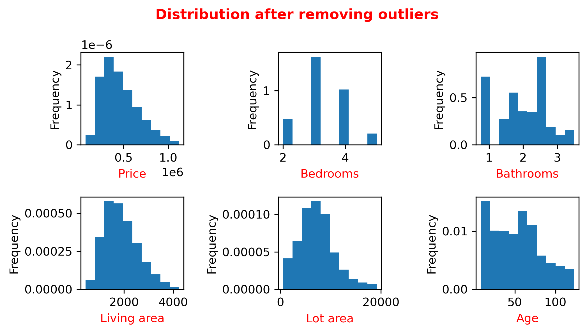
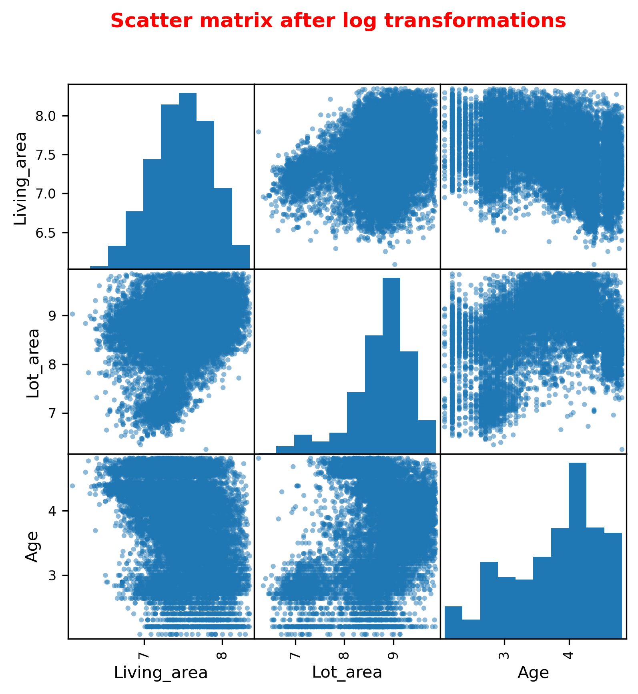
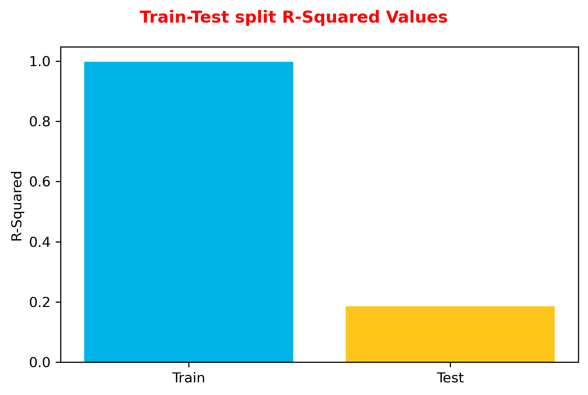

## DAT Phase 2 Project

**Student name: Ravinarayan Raghupathi, MSc PhD**

**Instructor name: Hardik Idnani**

### Overview

#### The brief
Use regression modeling to analyze house sales in a northwestern US county.
#### Business Problem
Which factors influence and can help improve King County house sales?

### My strategy
  

    
After going through the column descriptors, I decided to examine the following key indicators (independent variables) from the given dataset that affect the sale prices of properties (the dependent variable) in King County:
        
1. Number of bedrooms
    
2. Number of bathrooms
    
3. Living area (in square feet)
    
4. Lot area (in square feet)
    
5. Number of floors
    
6. Condition of the property
    
7. Property grade

I also created another independent variable which is the age of the property.

**I used the following steps to achieve my outcomes:**
    

### Step 1: Exploratory data analysis
   

    
Here I analysed the given dataset to create a dataframe, decided which variables to use, dropped unnecessary columns, checked for NaN and unique values, renamed columns and created the 'Age' column. 
        

        
### Step 2: Baseline model (Iteration 1)
I performed multilinear regression, created a baseline model and tested assumptions of regression in that model.
#### Distribution of predictors
Checked how the predictors are distributed using combined KDE and histogram plots.

#### Linearity check
Used scatter plots to check the relationship between the dependent and the independent variables.

#### Created the Baseline model

#### Tested assumptions of regression - Model 1

    
Here I analysed whether the model satisfied the assumptions of homoskedasticity and normality. The assumption of linearity has already been visualised above.
    

    
##### Skedasticity check

##### Normality check
        

### Observations - Baseline model
   

    
1. The adjusted R-squared value of 0.618, the high F-Statistic and the corresponding significant p-values appear to indicate some linear relationship between the chosen independent and dependent variables, however, this may be misleading in a baseline model.
2. There is a combination of continuous and categorical variables. It is safe to say that "Floors', 'Condition' and 'Grade' are categorical variables and need to be transformed accordingly. Further, during the next iteration, one needs to see if 'Bedrooms' and 'Bathrooms' will also need to be considered categorical variables.
3. With the exception of 'Age', the distribution of all continous variables appear to be heavily right-skewed, probably because of outliers (as can be seen from the scatter plots). Outliers will need to be eliminated.
4. It appears that the homoskedasticity and normality assumptions cannot be satisfied in this iteration, given the skew of the Q-Q plot and the high values for the JB test, kurtosis and skewness.
    

    
### Step 3: Model 2 (Iteration 2)

    
I eliminated outliers, created dummy variables, checked for multicollinearity, transformed variables, rendered a revised model and retested assumptions of regression in the new model.
    

    
#### Outlier check
   

    
Here I visualised the outliers in the remaining independent variables using boxplots, to decide the next steps.
        

    
From the above, it seemed like the outlier in Bedrooms did not make sense, given its huge difference from the mean and a value of 33 (as observed from the Linearity check in Iteration 1). It might have been possibly due to a typo during the original data entry. I compared that entry with 3-bedroom examples from the dataset and found that the entries were similar in nature. I therefore replaced the value 33 with a 3, so that the row did not need to be included in outlier removal. I then removed outliers from the independent variables using the IQR method and checked their distribution with a histogram. 
    

    
#### Checking distribution after removing outliers

    
The distributions have improved and are appearing more normal than before. 'Bedrooms' and 'Bathrooms' are seen to be categorical variables, all of which will be dealt with in the next step.
    

#### Dealing with categorical variables
   

    
I used one-hot encoding to convert all the categorical variables into dummies and created a new dataframe with the dummies included. I then checked for columns for dummy variables in each category that could be dropped. It appeared that 'Bathrooms', which included part bathrooms (up to two decimal places), as referred to by real estate policies could be reduced to fewer categories for simplicity. Here I chose to use only columns of bathrooms that were either round numbers or had one decimal place.
        

#### Multicollinearity check
   

    
I checked for multicollinearity using scatter and correlation matrices with corresponding subsequent analysis. I then dropped highly correlated columns (i.e., correlation greater than 0.75) before future analyses. In this case, they were the categorical value columns 'Cond_3' and 'Cond_4'.
      

      

#### Log transformation of independent variables
   

    
I performed log transformation of the variables 'Living_area', 'Lot_area' and 'Age', and visualised the results with a histogram and a scatter matrix.
         

#### Created Model 2

#### Tested assumptions of regression - Model 2
   

    
Here I analysed whether Model 2 satisfied the assumptions of linearity, homoskedasticity and normality.
        

        
##### Linearity check

##### Skedasticity check

##### Normality check

### Observations: Model 2
   

    
1. The adjusted R-squared value has reduced, however there may still be linearity between our dependent and the three independent variables.
2. The skew and kurtosis values have reduced dramatically and are closer to values representing normal distribution.
3. There are a few categorical variables whose p-values indicate that they are not significant and can be eliminated in the next iteration.
4. 'Living area' appears to show some linearity with 'Price', but the linear relationship between 'Price' and 'Lot_area' and 'Age' is still not well-defined.
5. 'Living area' and 'Lot area' still show heteroskedasticity, whilst 'Age' appears to show homoskedasticity.
6. The normality plot has improved and shows a more linear relationship between Theoretical and Sample quantiles, indicating that further tweaking of the model might improve this feature.
    
 

### Step 4: Model 3 (Iteration 3) and Model 4 (Iteration 4)
   

    
Here I eliminated non-significant categorical variables, performed feature scaling, rendered a revised model after each step, chose the best model and retested assumptions of regression for that model. 

For Model 3, I chose to remove columns of categorical variables that were shown (in Model 2) not to be significantly related to the dependent variable and included three from the 'Floors' category. The number of floors might also not generally factor in property purchase decisions (exceptions include but are not limited to people who are differently-abled or those looking for office space). Given that the dataset did not include or indicate those factors, I decided to remove the "Floors' set of variables and ran the model.

For Model 4, I performed mean normalisation on the independent variables and ran a new model. I then chose to go with Model 4 for further analyses. Model 3 is not displayed on this page but is referred to in the observations and is available in the Jupyter notebook.
        

#### Created Model 4

#### Tested assumptions of regression - Model 4

    
Here I analysed whether Model 4 satisfied the assumptions of linearity, homoskedasticity and normality.
        

        
##### Linearity check

##### Skedasticity check

##### Normality check

### Observations: Models 3 and 4

    
1. There is no significant improvement in the Adjusted R-Squared value in either Model 3 or Model 4, however the condition number has significantly reduced, especially after feature scaling, suggesting that any multicollinearity or other errors indicated in earlier models have been eliminated. Removal of certain columns had almost the same effect as feature scaling (also see note below). 
2. There is no significant change in the assumptions of regression from Model 2, indicating that the relationship between the independent and dependent variables appears to be reasonably robust. The skewness and kurtosis levels are within tolerated limits.
3. The coefficients for the constant and the three independent variables are all in the exact centre for the narrow ranges of each of the 95% confidence intervals. This appears to be true for the categorical variables as well. This corroborates Point 2 above. 
4. The coefficients for 'Living area' and 'Age' are positive, indicating that an increase in either causes an increase in sale price, whilst the opposite is true of 'Lot area' (with a negative coefficient). 

<b>Note: I used various permutations of column removals/feature scaling and reran models each time, but was unable to find any model that improved the existing results. In fact, most of those models had a much lower Adjusted R-squared value and increased skew and kurtosis. I have not included those iterations herein. Model 4 will be the final model used in this study.</b>
      

### Step 5: Model validation
   

    
Here I performed both Train-Test splits and Cross-Validation on the final model. I compared the R-Squared and Mean Squared Error values across the splits, and computed the accuracy of the model.  
        

        
##### Train-test split visualisations.

##### Cross validation visualisations

<b>Accuracy of the model: 0.5400669334410992</b>

### Conclusions
   

    
1. The final model is overfitting as evidenced by the significant differences in R-Squared and Mean Squared Error values between the Train and Test datasets. Interestingly, cross-fold validation appears to show that the model is fitted correctly but that can be explained by the fact that it does not shuffle the data before splitting it into folds. This might mean that there are some aspects of the splits that are not representative of what the actual training data and test data are.
2. The model will predict correctly around 54% of the time, which is acceptable since it is an inference model.
3. The best indicator for a good sale price for a property appears to be the size of the living area. The age of the property might be a factor although the spread suggests that some older properties also sell at high prices. This could possibly be because the data includes heritage properties, etc. The area of the lot, and the number of bedrooms and bathrooms has an inverse relationship with sale prices. It is possible that bigger lots require more maintenance or development. Buyers might be looking for fewer bedrooms in a larger living space. It is logical to assume that the better the condition and grade of the property, the better the sale value. 
    

    
### Actionable insight
   

    
The two main co-efficients I would choose to infer property sale prices in King County are "Living_area' and 'Lot_area'. 
        
